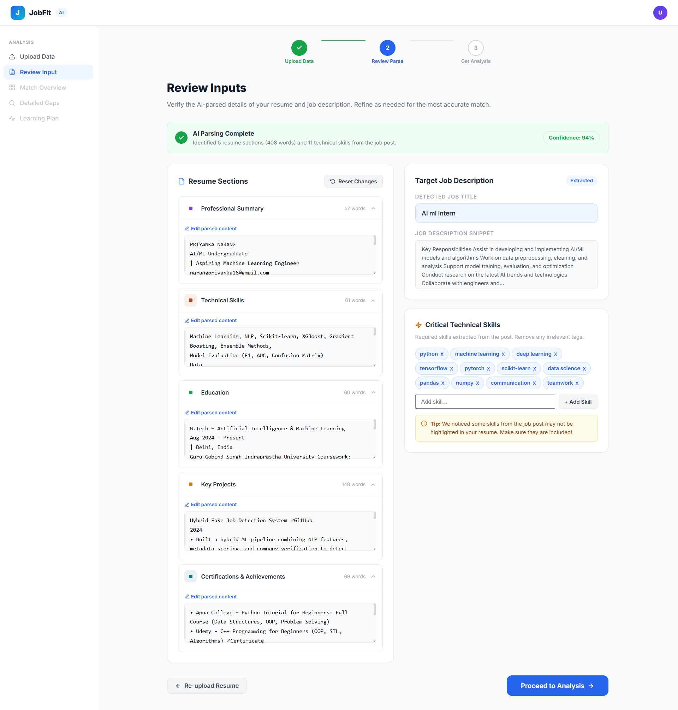
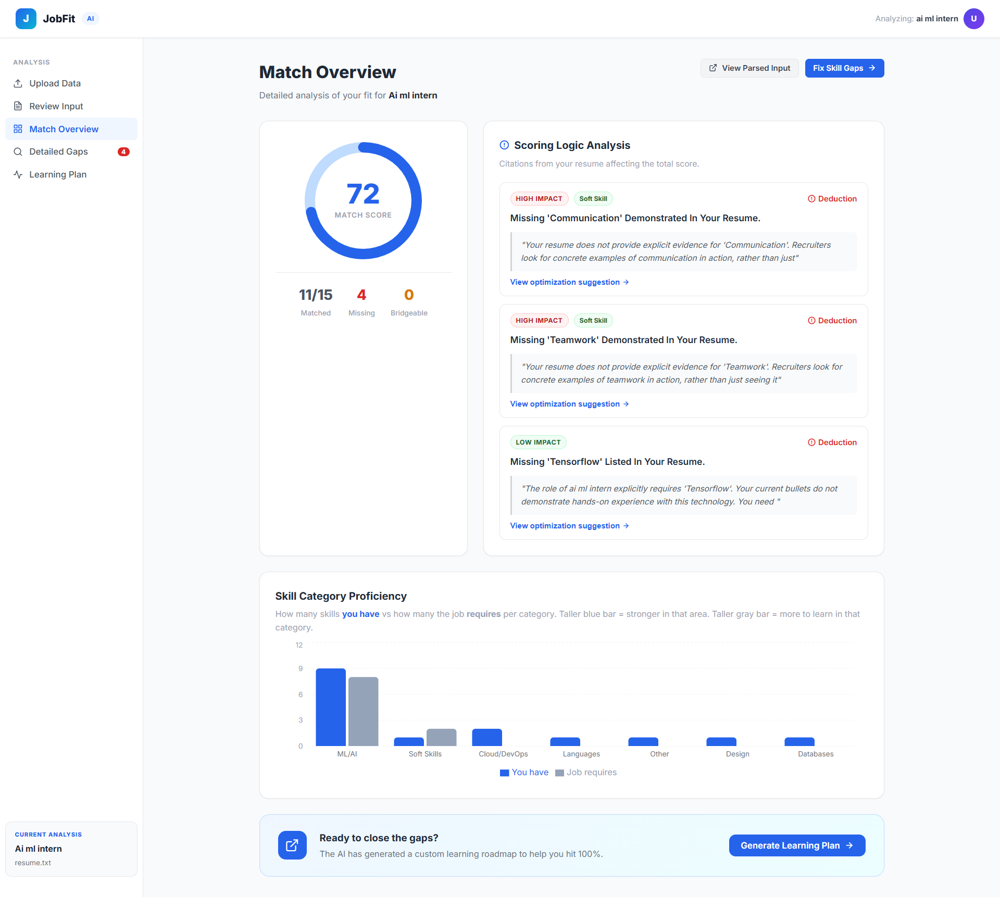
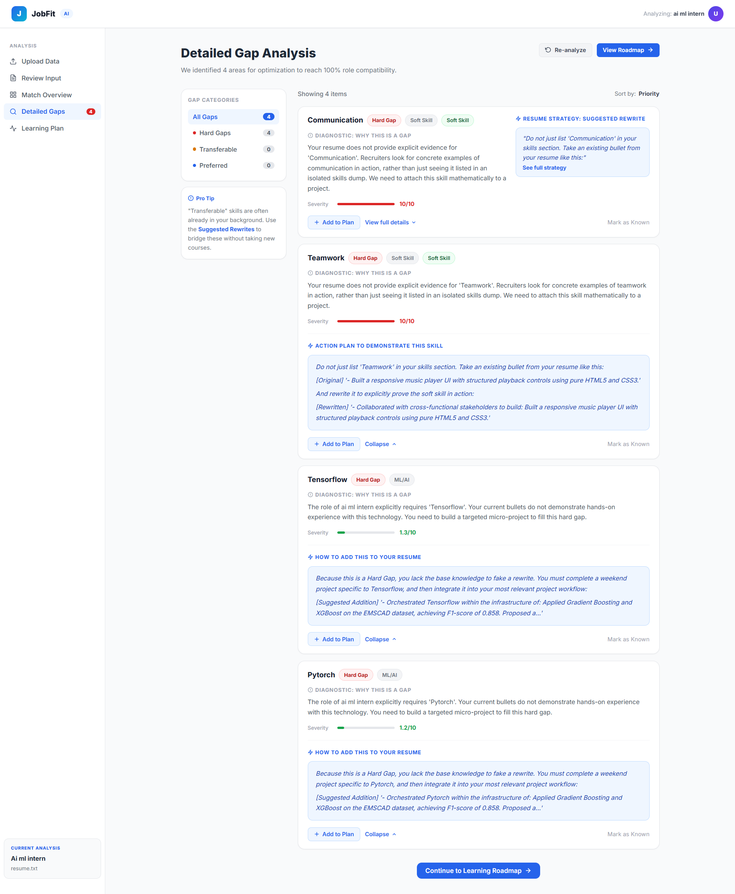
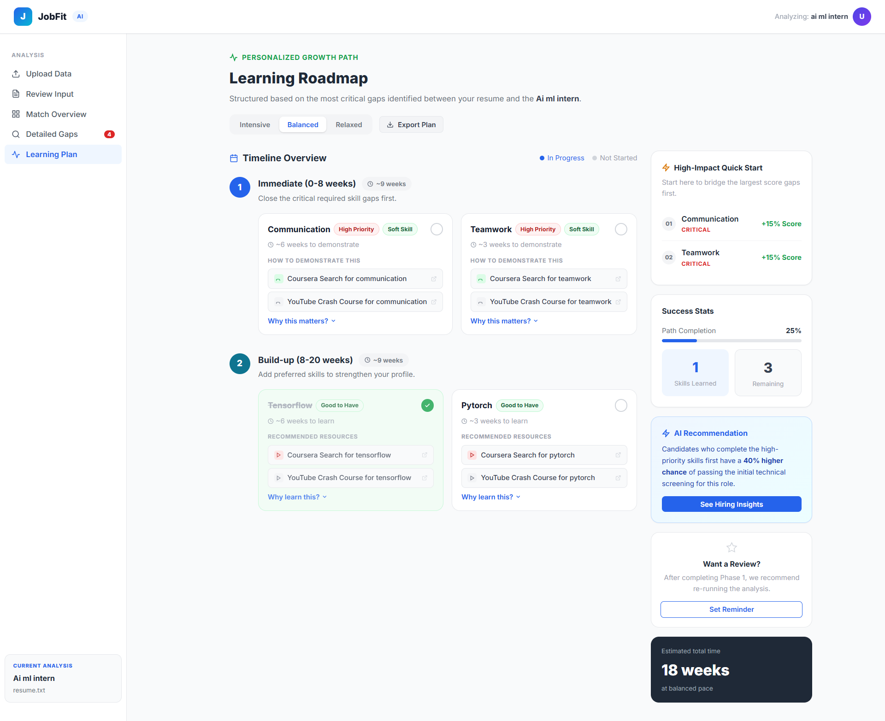

# Smart Resume Analyzer Pipeline

AI-powered resume analysis with skill gap detection and explainable feedback.
Built for B.Tech AI/ML second year project.


## 🚨 The Problem
Traditional Applicant Tracking Systems (ATS) and resume scorers are often flawed black-boxes. They reject highly capable candidates simply due to rigid keyword matching, failing to recognize **transferable skills** (e.g., penalizing a candidate for lacking "PyTorch" even if they have extensive "TensorFlow" experience). Furthermore, existing tools provide arbitrary "match percentages" without actionable feedback or evidence of *why* sections were scored poorly. 

## 💡 The Solution
To solve this, I engineered a data-driven **Smart Resume Analyzer** that replaces rigid keyword matching with context-aware, explainable AI:

1. **Transferable Skill Detection:** Utilizes a custom domain ontology to identify adjacent skills that "bridge" gaps, ensuring competent candidates aren't heavily penalized for framework differences.
2. **Evidence-grounded Feedback (XAI):** Rather than giving arbitrary scores, the system extracts precise sentences directly from your uploaded resume as undeniable "evidence" to explain *why* you received that score.
3. **Data-Driven Severity Scoring:** Instead of treating all missing skills equally, it ranks dynamically detected gaps by "Severity" using an ML model trained against real-world job description frequencies.
4. **Interactive Dashboard:** Complete React frontend providing visual score gauges, prioritized gap cards, and an AI-drawn learning timeline.

## 📸 Application Screenshots

Here is a look at the interactive React frontend in action:







## Project Structure

This repository has been structured for clean navigation:

- **`resume_analyzer/`** - The core application (Backend, Frontend, and ML Models). See its [internal README](resume_analyzer/README.md) for detailed setup and run directions.
- **`docs/`** - Detailed documentation, methodology, and research insights.
    - [`Pipeline_Methodology.md`](docs/Pipeline_Methodology.md): Step-by-step methodology of the ML and parsing pipeline.
    - [`models_overview.md`](docs/models_overview.md): Technical breakdown of the models.
- **`data_archive/`** - Raw and source datasets used for training and testing the ML pipeline.

## Quick Start

1. Navigate into the main application directory:
   ```bash
   cd resume_analyzer
   ```
2. Follow the setup directions inside [resume_analyzer/README.md](resume_analyzer/README.md) to install dependencies and run the frontend and backend servers.

---
*For the full source code and setup instructions, please enter the `resume_analyzer/` directory.*
